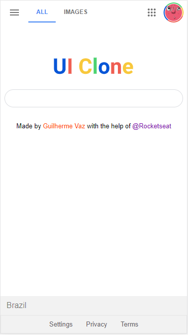
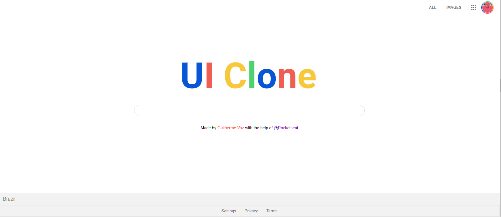

# Sobre | About:
Clone da Interface do Google usando apenas HTML/CSS | Google Interface clone using only HTML / CSS

## Ferramentas usadas | Used tools:

Uso HTML/CSS sem nenhum uso de framework/library | Use HTML / CSS without any use of framework / library

## Como foi desenvolvido | How it was developed:

Através de um vídeo disponibilizado no canal da rocketseat, pude acompanhar o passo a passo e fazer alterações que fossem de meu interesse! 
Through a video available on the rocketseat channel, I was able to follow the step by step and make changes that were of interest to me!

## Versão Mobile | Version Mobile:

## Versão Desktop | Version Desktop:

## Agradecimentos | Thanks:
[Rocketseat](https://www.youtube.com/watch?v=KgjzE1Sxtq0) 
[Guilhermerodz](https://github.com/guilhermerodz)
